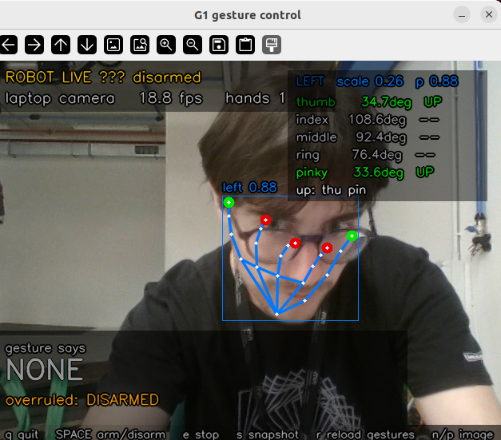

# Hands On — gesture control for a Unitree G1

**A hackathon where a humanoid robot does what your hands tell it to.**

Hold up an open palm and the robot stops. Point one finger and it walks forward.
That much already works when you clone this repository. Everything else — going
backwards, stepping sideways, turning on the spot, and whatever else you invent
— is what you are here to build. And then, in the second half of the day, to
take apart: you will be handed another team's working gesture controller and
asked to find the frame that makes it do the wrong thing.

You do not need the robot to start. You do not need the robot for most of the
day. The default mode uses your laptop's webcam and prints the action the robot
*would* take, and it is the mode you should develop in.

---

## Table of contents

- [What you are building](#what-you-are-building)
- [The two modes](#the-two-modes)
- [Setup](#setup)
- [Running it](#running-it)
- [The code](#the-code)
- [The interface](#the-interface)
- [Phase 1 — build](#phase-1--build)
- [Phase 2 — break](#phase-2--break)
- [Safety](#safety)
- [Troubleshooting](#troubleshooting)
- [Where this comes from](#where-this-comes-from)

---

## What you are building

One class, in one file: `participant/gestures.py`.

It receives one `Observation` per camera frame — where the hands are, how bent
each finger is, how big the hand looks, how sure the tracker is — and it returns
one `Action`. That is the entire contract:

```python
class GestureRecognizer:
    def update(self, obs: Observation) -> Action:
        ...
```

Everything else in the repository is infrastructure: the camera, the hand
model, the preview window, the safety layer, and the code that talks to the
robot. It is frozen. You will not need to change it, and at the end of the day
your work is run against a clean copy of it, so any change you did make will
quietly disappear.

### The command vocabulary

| Action | Meaning | vx (m/s) | vy (m/s) | wz (rad/s) |
|---|---|---|---|---|
| `STOP` | stand still — *a decision* | 0 | 0 | 0 |
| `FORWARD` | walk forward | +0.40 | 0 | 0 |
| `BACKWARD` | walk backward | −0.25 | 0 | 0 |
| `LEFT` | step left, still facing forward | 0 | +0.25 | 0 |
| `RIGHT` | step right, still facing forward | 0 | −0.25 | 0 |
| `ROTATE_LEFT` | turn on the spot, anticlockwise | 0 | 0 | +0.50 |
| `ROTATE_RIGHT` | turn on the spot, clockwise | 0 | 0 | −0.50 |
| `NONE` | *no decision* — "I cannot read the operator" | 0 | 0 | 0 |

`NONE` and `STOP` both leave the robot standing still and they are **not the
same answer**. `STOP` says you recognised the stop gesture. `NONE` says you
recognised nothing. Phase 2 scores them separately, and a recognizer that says
`STOP` whenever it is confused will be marked down for it — because a controller
that cannot tell "the operator asked me to hold" from "I have no idea what I am
looking at" is a controller nobody can trust.

Need a motion that is not on the list? Define it in `participant/gestures.py`
with `define_action("NAME", vx=..., vy=..., wz=...)`, in the section marked
`YOUR CUSTOM ACTIONS START HERE` — as many as you like, each with its own name.
Do not edit `core/actions.py`. Custom actions go through the same speed clamp
as the built-ins, so you cannot use them to go faster.

### What ships working

| Gesture | Action |
|---|---|
| Open palm, all five fingers up | `STOP` |
| Index finger only | `FORWARD` |

That is the whole baseline, and it is about eighty lines of very naive code.
Read it before you extend it.

---

## The two modes

### No-robot mode — the default

```bash
python3.10 run.py
```

Your laptop webcam, a preview window with the detected hand skeleton and the
per-finger numbers, and the action your recognizer chose displayed across the
bottom. Nothing moves. This is where you will spend almost all of your time.

You can also feed it stills instead of a camera — a single file, or a whole
folder you step through with `n` and `p`:

```bash
python3.10 run.py --image shots/tricky_palm.jpg
python3.10 run.py --image shots/
```

### Robot mode

```bash
python3.10 run.py --robot --iface enp3s0
```

The real G1. It takes its camera feed from the camera in its own head and walks
when you tell it to. The robot must **already be standing** in its locomotion
state (FSM 801) — the program checks and refuses to start otherwise. To stand
it up from a squat as part of the run, add `--standup`; never do that with a
robot that is already standing, because the sequence starts by going limp.

With the robot's camera the loop runs at **2 frames per second** (`--robot-hz`),
not the 20 you are used to on a laptop, so `obs.dt` is about 0.5 s. Count how
long a gesture has been held in seconds (`obs.t`), not in frames — a "hold for
10 frames" rule takes half a second on your laptop and five on the robot.

Motion starts **disarmed**. Nothing moves until a human presses `SPACE` in the
preview window, and `e` disarms it again on the next frame — up to half a
second at 2 Hz. Robot mode runs in organiser-supervised slots only — see
[Safety](#safety).

If the robot's own camera is awkward for a demo, keep the robot moving but read
gestures from your laptop instead. This runs at the normal 20 Hz:

```bash
python3.10 run.py --laptop-robot --iface enp3s0     # same as --robot --local-camera
```

---

## Setup

### 1. Get the code

```bash
git clone <this repo url>
cd g1_gesture_hackathon
```

### 2. Install the vision stack

Python **3.10** or newer.

```bash
pip install -r requirements.txt
```

If `models/hand_landmarker.task` did not come with your clone (it is a 7.8 MB
binary and some mirrors strip it), fetch it:

```bash
wget -O models/hand_landmarker.task \
  https://storage.googleapis.com/mediapipe-models/hand_landmarker/hand_landmarker/float16/latest/hand_landmarker.task
```

### 3. Check

```bash
python3.10 tools/check_setup.py
```

Every line should say `ok`. If `webcam` or `a window can be opened` says `warn`,
you can still work — use `--image` and `testing/run_suite.py` — but talk to an
organiser.

### 4. Only for robot mode

Robot mode needs the Unitree SDK, which is not on PyPI, and a wired connection
to the robot. The organisers' laptop already has both. If you are setting up
your own, follow the steps below. They are a condensed version of Unitree's
official [G1 quick development guide](https://support.unitree.com/home/en/G1_developer/quick_development),
which is worth reading if anything here does not match what you see.

Unitree supports development on **Linux only** (they recommend Ubuntu 20.04;
this repo is tested on Ubuntu 22.04 with Python 3.10). On Windows or macOS,
see [Connecting from Windows or macOS](#connecting-from-windows-or-macos).

#### 4a. Install the SDK

```bash
git clone https://github.com/unitreerobotics/unitree_sdk2_python
pip install cyclonedds==0.10.2       # must match the SDK exactly
pip install -e unitree_sdk2_python
```

If `pip install -e` fails with `Could not locate cyclonedds. Try to set
CYCLONEDDS_HOME or CMAKE_PREFIX_PATH`, build cyclonedds 0.10 from source and
point the SDK at it:

```bash
git clone https://github.com/eclipse-cyclonedds/cyclonedds -b releases/0.10.x ~/cyclonedds
cd ~/cyclonedds && mkdir build install && cd build
cmake .. -DCMAKE_INSTALL_PREFIX=../install
cmake --build . --target install
export CYCLONEDDS_HOME=~/cyclonedds/install
cd - && pip install -e unitree_sdk2_python
```

#### 4b. Wire up the network

1. Plug an Ethernet cable from your laptop into the robot (a USB-Ethernet
   adapter is fine). The robot's onboard computer is at `192.168.123.161`.
2. Find your interface name — this is what you pass to `--iface`
   (default `enp3s0`; USB adapters usually look like `enx…`):

   ```bash
   ip link show
   ```

3. Give that interface a static address in the robot's subnet,
   `192.168.123.X/24`. Unitree suggests `192.168.123.99`; anything unused that
   is not `.161` works. Do **not** set a gateway on it.

   Quick, until the next reboot or cable unplug:

   ```bash
   sudo ip addr add 192.168.123.99/24 dev enp3s0
   ```

   Permanent, with NetworkManager (Ubuntu desktop) — or do the same in
   *Settings → Network → Wired → IPv4 → Manual*:

   ```bash
   nmcli con add type ethernet ifname enp3s0 con-name g1 \
     ipv4.method manual ipv4.addresses 192.168.123.99/24 ipv6.method ignore
   nmcli con up g1
   ```

4. Check the SDK is installed, the robot answers, and DDS gets through. The
   last command only *reads* the robot's state — it does not move it — and
   should print two numbers (e.g. `801 0`); `-1 -1` after ~10 s means the
   SDK cannot reach the robot:

   ```bash
   python3.10 tools/check_setup.py --robot
   ping -c 3 192.168.123.161
   python3.10 -c "from core.g1_robot import G1Robot; b = G1Robot('enp3s0'); print(b.fsm_id(), b.fsm_mode())"
   ```

   A crash *after* the numbers are printed is the harmless cyclonedds
   teardown bug (see [Troubleshooting](#troubleshooting)).

`ping` working only proves the cable and the address. The SDK talks over DDS
(UDP multicast on ports 7400+), so a firewall that allows ping can still block
it — on Ubuntu, `sudo ufw allow from 192.168.123.0/24` if `ufw` is active.

#### Connecting from Windows or macOS

**No-robot mode works natively everywhere.** MediaPipe and OpenCV ship wheels
for Windows, macOS (Intel and Apple Silicon) and Linux, so steps 1–3 are all
you need for most of the day. On Windows, replace `python3.10` with
`py -3.10` in every command.

**Robot mode needs Linux.** Unitree does not support the SDK on Windows or
macOS, and DDS discovery does not survive most of the networking layers those
systems put in front of Linux. Options, best first:

| Option | How | Notes |
|---|---|---|
| Use the organisers' laptop | — | Already set up. The default during robot slots. |
| Boot Linux | Dual-boot, or a live Ubuntu 22.04 USB stick | Then follow 4a and 4b as written. Most reliable. |
| Linux VM, **bridged** | VirtualBox / VMware / Parallels / UTM; set the VM's network adapter to *Bridged* onto the Ethernet port wired to the robot (or pass the USB-Ethernet adapter through to the VM), then do 4a and 4b *inside the VM* | Tested working. NAT mode will not work. On Apple Silicon use an ARM64 Ubuntu image. |
| WSL2 (Windows) | Enable mirrored networking (`networkingMode=mirrored` under `[wsl2]` in `%UserProfile%\.wslconfig`, then `wsl --shutdown`), then do 4a and 4b inside WSL | Not confirmed working. Ping works, but inbound DDS traffic is dropped by Windows Firewall; if the FSM check in 4b prints `-1 -1`, add the inbound rule below. |
| Docker Desktop (Windows/macOS) | — | Does not work: DDS multicast does not cross Docker Desktop's VM. |

The Windows Firewall rule for WSL2 — opens only the DDS ports, only from the
robot's subnet:

```powershell
New-NetFirewallRule -DisplayName "Unitree G1 DDS" -Direction Inbound -Protocol UDP `
  -RemoteAddress 192.168.123.0/24 -LocalPort 7400-7500 -Action Allow
# to undo: Remove-NetFirewallRule -DisplayName "Unitree G1 DDS"
```

Where the static address goes: on a bridged VM, on the VM's interface (step
4b inside the VM), not the host's. On WSL2 in mirrored mode, WSL sees the
wired adapter as `eth0`/`eth1` (check with `ip link show`); that is your
`--iface`, and `sudo ip addr add 192.168.123.99/24 dev eth1` inside WSL has
to be rerun every session.

---

## Running it

```bash
python3.10 run.py                                  # webcam, nothing moves
python3.10 run.py --camera 1                       # a different webcam
python3.10 run.py --image shots/                   # stills from a path
python3.10 run.py --mirror                         # flip the preview
python3.10 run.py --impl teams/blue/gestures.py    # run someone else's recognizer
python3.10 run.py --robot --iface enp3s0           # the real robot
python3.10 run.py --robot --local-camera           # robot moves, laptop watches
python3.10 run.py --laptop-robot                   # same thing, one flag
```

### Keys in the preview window

| Key | |
|---|---|
| `q` / `Esc` | quit |
| `SPACE` | arm / disarm robot motion (robot mode only) |
| `e` | emergency stop — disarm and halt |
| `s` | save the current frame to `captures/` |
| `r` | reload `gestures.py` without restarting (disarms first) |
| `n` / `p` | next / previous image, when running `--image` on a folder |

`r` is the one that will save you the most time. Edit your file, press `r`, keep
your hand where it was.

### All the flags

| Flag | Default | |
|---|---|---|
| `--robot` | off | drive the real robot |
| `--iface` | `enp3s0` | network interface wired to the G1 |
| `--local-camera` | off | with `--robot`: read gestures from the laptop webcam |
| `--laptop-robot` | off | laptop webcam, real robot moves — shorthand for `--robot --local-camera` |
| `--standup` | off | stand the robot up from a squat first. Off: it must already stand in FSM 801 |
| `--yes` | off | skip the confirmation prompt before robot mode starts |
| `--camera` | `0` | webcam index |
| `--image PATH` | — | an image file or a folder of them |
| `--mirror` | off | flip frames horizontally — **also swaps the left/right hand labels** |
| `--max-hands` | `2` | how many hands the tracker may report at once |
| `--detect-hz` | `20` | cap on detections per second |
| `--robot-hz` | `2` | detections per second when reading the robot's camera (replaces `--detect-hz` there) |
| `--impl` | `participant.gestures` | which recognizer to run |
| `--no-display` | off | no preview window |
| `--model` | `models/hand_landmarker.task` | alternative hand model |

---

## The code

```
g1_gesture_hackathon/
│
├── participant/
│   └── gestures.py          ←←←  YOUR FILE. This is the one you edit.
│
├── run.py                   the launcher
├── core/                    FROZEN — read it, do not change it
│   ├── actions.py             the command vocabulary and the speed limits
│   ├── observation.py         what your recognizer is given each frame
│   ├── hand_tracker.py        MediaPipe → Observation
│   ├── camera.py              webcam / robot camera / stills
│   ├── safety.py              the layer your output has to get past
│   ├── robot.py               stand-up sequence and Action → robot velocity
│   ├── engine.py              the main loop and the keyboard
│   ├── hud.py                 the preview window
│   ├── g1_robot.py            Unitree SDK wrapper (copied from g1_control)
│   └── _video_fetcher.py      robot camera subprocess (copied from g1_control)
│
├── testing/                 phase 2
│   ├── run_suite.py           score a recognizer against labelled stills
│   ├── cases/                 your labelled stills go here
│   ├── ambiguous/             stills with no single right answer
│   └── report_template.md     what you hand in
│
├── tools/check_setup.py     run this first
├── models/                  the MediaPipe hand model
└── captures/                frames saved with the `s` key
```

**You edit `participant/gestures.py`.** Inside it, the editable region is marked:

```python
# ══════════════════════════════════════════════════════════════════
#  EDIT FROM HERE
# ══════════════════════════════════════════════════════════════════
```

Above that line are the imports and the explanation of the interface. Below it,
everything is yours — the tuning constants, the gesture table, the helper
functions and the body of `GestureRecognizer`. Two things inside the editable
region must keep their shape, and they are marked `KEEP` where they appear:

1. the class is called `GestureRecognizer`
2. it has a method `update(self, obs) -> Action`

Break either and the launcher refuses to start rather than running something
unpredictable at a humanoid.

If one file gets crowded, add more next to it — `participant/filters.py`,
`participant/poses.py`, whatever — and import them from `gestures.py`. Anything
under `participant/` travels with your submission.

Every file in `core/`, plus `run.py` and `testing/run_suite.py`, opens with a
**FROZEN FILE, DO NOT EDIT** banner. This is not bureaucracy: in phase 2 your
recognizer is run inside someone else's checkout and theirs inside yours, and
that only works if the frozen files are identical everywhere. A gesture that only works because you widened a threshold in
`core/hand_tracker.py` will not work at all when it is judged.

---

## The interface

### `Observation` — one per frame

| | |
|---|---|
| `obs.hands` | detected hands, largest first. May be empty. May hold more than one. |
| `obs.any_hand` | the largest hand, or `None` |
| `obs.hand("left")` | a specific side, or `None` |
| `obs.t` | seconds since the program started |
| `obs.dt` | seconds since the previous frame |
| `obs.width`, `obs.height` | frame size in pixels |
| `obs.frame` | the camera image itself (BGR numpy array) — for bringing your own model, see the optional section in `gestures.py` |

### `Hand`

| | |
|---|---|
| `hand.extended` | `{"thumb": True, "index": True, ...}` — a convenience, not a truth |
| `hand.curl` | `{"thumb": 12.4, "index": 151.0, ...}` degrees, 0 = perfectly straight |
| `hand.fingers_up()` | `["index"]` |
| `hand.count_up()` | `1` |
| `hand.px` | 21 landmarks in pixels |
| `hand.lm` | 21 landmarks normalised to 0..1 |
| `hand.world` | 21 landmarks in metres, scale-invariant — use these for angles |
| `hand.bbox`, `hand.center()` | pixel bounding box and its centre |
| `hand.scale` | hand size ÷ frame size, a rough proxy for distance |
| `hand.score` | MediaPipe's own confidence, 0..1 |
| `hand.side` | `"left"` or `"right"` |

Two of these deserve a warning.

**`hand.extended` is a guess.** `core/hand_tracker.py` fills it by thresholding
`hand.curl` at one fixed number for every finger except the thumb, which gets
its own because the thumb folds by rotating at its base rather than by bending
and produces much less curl than the others. Those numbers are a starting point
somebody picked. When `extended` disagrees with what you can plainly see in the
preview window, threshold `curl` yourself. That is not cheating; it is the job.

**`hand.side` is MediaPipe's opinion**, computed for an unmirrored image. With
`--mirror` the labels swap, and whether a given camera hands you a mirrored
image at all is a thing you should verify rather than assume. If a gesture is
supposed to mean different things on different hands, check this yourself
before you build on it.

The full detail lives in `core/observation.py`, and reading it is worth five
minutes.

---

## Phase 1 — build

Make the robot do everything in the vocabulary, reliably.

**You owe us:** `BACKWARD`, `LEFT`, `RIGHT`, `ROTATE_LEFT`, `ROTATE_RIGHT`, on
top of the `STOP` and `FORWARD` that already work — plus at least one gesture of
your own invention that is not in the table, using `custom_action()` if it needs
a motion the vocabulary does not have.

**And then the harder half: make them robust.**

Counting extended fingers is the obvious way to recognise a pose. It is not the
only way and it is not a very good one. Fingertip positions, the direction the
palm faces, the angle the hand is tilted at, where in the frame it sits, and how
any of those change from frame to frame are all sitting in `obs`, unused.

Some questions worth having an answer to before somebody else asks them:

- Your recognizer decides from a single frame. What happens on the one frame
  where the tracker gets it wrong?
- Your gesture table matches poses exactly. What does a hand halfway between two
  gestures come out as?
- `obs.hands` is a list. What is your rule for which entry to obey, and what
  happens when that rule picks the wrong one?
- `hand.score` and `hand.scale` are right there and the baseline barely uses
  them. What would you do with them?
- Is your gesture set even a good one? Two gestures that look similar to a
  camera are a problem you can design away instead of coding around.

Test on more than yourself. Hands vary more than you think they do.

**At the end of phase 1** your recognizer should survive an organiser walking up
to your laptop and running through the whole vocabulary, and each team gets a
supervised slot to run it on the real robot.

---

## Phase 2 — break

You swap. Each team receives another team's `participant/` folder, drops it into
their own checkout, and runs it:

```bash
python3.10 run.py --impl teams/red/gestures.py
```

Your job is to find where it fails. Not to admire it — to find the input that
makes a robot that should be standing still start walking, or makes it go left
when the operator clearly asked for right, or makes it do nothing at all while
somebody stands in front of it waving.

You have three ways in:

1. **Live, with the laptop camera.** Stand in front of it and try things. Press
   `s` whenever you catch a failure; the frame lands in `captures/`.
2. **Stills.** `python3.10 run.py --image some_folder/` replays saved frames
   through the recognizer as many times as you like, so a failure you found once
   is a failure you can show an organiser.
3. **In bulk.** Sort your stills into folders named after the action each one
   *should* produce and score the whole set at once:

   ```
   testing/cases/
     STOP/        ...
     FORWARD/     ...
     ROTATE_LEFT/ ...
     NONE/        ...
   ```

   ```bash
   python3.10 testing/run_suite.py --cases testing/cases --impl teams/red/gestures.py
   ```

   It prints a per-label breakdown, an accuracy figure, and separately the count
   of cases where the robot moved when it should have held still or moved the
   wrong way. That last number is the one that matters.

   It only knows the seven built-in actions, though: a custom action that
   fires when it should not is counted as *wrong*, not as *moved wrongly*. If
   the team you are testing has invented gestures, check the per-label table
   for those by hand.

### What a finding looks like



This frame came from the laptop camera during testing. There is no hand in it.
MediaPipe drew a hand skeleton over the operator's face anyway: wrist on the
chin, fingertips on the glasses and forehead. It labelled it `left` with a
confidence of 0.88, and it read the thumb and pinky as up.

Look at what the baseline's own filters make of that. A score of 0.88 clears
`MIN_SCORE` (0.5) and a scale of 0.26 clears `MIN_SCALE` (0.05), so this
"hand" is accepted as the operator's. The baseline returned `NONE` here only
because thumb-and-pinky is not in its gesture table. A team that maps that pose
to an action — or that accepts "nearly" a pose it knows — has a robot that walks
when someone looks at it. The safety layer will not catch it either: it stops
the robot when no hand is seen, and here a hand *is* seen.

That is one finding, written up the way we want them all: the saved frame, what
the recognizer did with it, and why. Save frames like this one with `s` and put
them in `testing/cases/NONE/`, because a frame with no hand in it should never
command anything.

**We are not going to tell you what to test.** Working out what a camera-driven
controller is likely to be bad at, and then building the smallest case that
proves it, *is the exercise*. A team that arrives with a list of conditions they
thought of themselves and evidence for each will beat a team that arrives with a
long list of conditions somebody handed them.

Two ground rules:

- **Attack the recognizer, not the harness.** Editing `core/` to make another
  team's code fail proves nothing. So does handing the suite a corrupt file.
  The target is the gesture logic.
- **Every finding needs a reproduction.** A saved frame, or a labelled case
  folder, or a written-down sequence anyone can repeat. "It felt unreliable" is
  not a finding.

### Inaccuracy — when nobody knows the right answer

Some of what you find will not be a bug, because there is no agreed correct
action to compare against. Two people in frame, one pointing forward and one
holding up a palm: should the robot walk or stop? A hand exactly halfway between
two gestures. A gesture made by someone in the background while the operator's
hand is down. The robot did *something*, and you cannot say it was wrong,
because you are not sure what right would have been.

Do not throw these away and do not force them into a case folder — the suite
can only score frames that have one expected answer. Keep the frames in
`testing/ambiguous/` and write each one up in the **Inaccuracy** section of the
report: what the robot did, which actions could be argued for, which one you
would pick and why. A situation the designers never made a decision about is a
finding in its own right — often a more useful one than a misread finger.

**You hand in** `testing/report_template.md`, filled in: what you tested, what
you found, and for each failure the reproduction and what you think the
underlying cause was, plus the ambiguous cases you could not score. Losing marks for failures found in your own code is much
better than nobody finding them before the robot does.

---

## Safety

A G1 is 1.3 m and 35 kg of humanoid and it walks. Treat it that way.

**Rules for robot mode, no exceptions:**

- The robot only runs in an organiser-supervised slot. An organiser holds the
  remote controller with a thumb on the emergency stop the entire time.
- Two metres of clear floor around it, minimum. Nobody behind it.
- The operator whose hands are being read stands where they can see the robot.
- Motion starts disarmed. `SPACE` arms it, `e` disarms it, `q` quits and stops.
  On the robot camera keys are read once per frame, so allow up to half a
  second — the remote is faster.
- If it does anything you did not expect, hit `e` first and work out why after.

**What the harness enforces for you** (in `core/safety.py`, and not switchable
off from your code):

- every velocity re-clamped to ±0.40 m/s forward, ±0.25 m/s sideways,
  ±0.50 rad/s turning, whatever your action claimed;
- stop if no camera frame has arrived for 0.8 s — with the laptop webcam. The
  robot camera keeps handing out its last frame if its stream dies, so a frozen
  feed is *not* caught: if the preview stops updating, press `e`;
- stop if no hand has been seen anywhere in frame for 1.0 s, so a gesture cannot
  latch — walk out of shot and the robot halts on its own;
- in robot mode, nothing at all until a human arms it;
- if your `update()` raises, that frame becomes `NONE` and the robot stops. Your
  bug will not run away with the robot. It will still be your bug.

That floor keeps a crash from becoming an incident. It does nothing whatsoever
about your recognizer confidently choosing the wrong action, which is the
failure mode that actually matters and the one phase 2 exists to find.

---

## Troubleshooting

| Symptom | Cause | Fix |
|---|---|---|
| `Hand model not found` | `models/hand_landmarker.task` missing | `wget` it — command in [Setup](#setup) |
| `Could not open camera index 0` | wrong index, or another app holds the camera | try `--camera 1`, close Zoom/Meet |
| Preview window never appears | no display available | run `tools/check_setup.py`; use `--image` and `run_suite.py` |
| Tracker sees nothing | hand too small, too dark, or out of frame | check `hands` in the top-left readout before blaming your code |
| Everything reads as `NONE` | no pattern in the table matched | look at the per-finger table on the right — the tracker may disagree with you about which fingers are up |
| Fingers flicker up/down | curl sitting right on the threshold | your problem to solve, and a good one |
| `left` and `right` look swapped | `--mirror`, or a mirroring camera | drop `--mirror`, and verify rather than assume |
| `The robot is in FSM …, not 801` | robot is not standing in locomotion mode | from a squat, rerun with `--standup` |
| Robot stand-up times out after 15 s | `--standup` used when the robot was not in a squat | squat it manually, then rerun |
| `FSM 801 not reached` | remote controller off | turn the remote on |
| No frames from the robot camera | cable, wrong `--iface`, robot off | check `ip link show`; fall back to `--local-camera` |
| Segfault or abort when the program exits | known cyclonedds 0.10.2 teardown bug | harmless, everything already ran — see the g1_control README |
| Robot mode complains about `unitree_sdk2py` | SDK not installed | see [Setup step 4a](#4a-install-the-sdk); it is not on PyPI |
| `ping 192.168.123.161` fails | no static IP, wrong interface, or cable | redo [step 4b](#4b-wire-up-the-network); check `ip addr show <iface>` lists `192.168.123.X/24` |
| `ping` works but the SDK gets nothing (FSM check prints `-1 -1`) | firewall dropping DDS UDP, or wrong `--iface` | allow UDP from `192.168.123.0/24`; on WSL2 see [Windows or macOS](#connecting-from-windows-or-macos) |

---

## Where this comes from

This repository is a slice of [`g1_control`](../g1_control), the working control
stack for this robot, repackaged so that the interesting decision is the only
thing left in front of you.

| Here | Came from |
|---|---|
| `core/g1_robot.py` | `g1_control/unitree_python.py`, unchanged — the `LocoClient` wrapper |
| `core/_video_fetcher.py` | `g1_control/camera/_video_fetcher.py`, unchanged |
| `core/robot.py` stand-up sequence | `g1_control/rnd_walk.py` — Damp → StandUp → wait → FSM 801 |
| `core/hand_tracker.py` | `g1_control/advanced_move/hand_pose_detector.py`, widened from three fingers to five |
| `core/camera.py` robot camera | the pipe protocol from `g1_control/camera/video_bridge.py` |
| speed limits in `core/actions.py` | the tested limits in `g1_control/rnd_walk.py` |

If you want to know why locomotion is entered through FSM 801 rather than the
FSM 200 the SDK documents, or what the G1's other control modes can do, the
`g1_control` README has the FSM table and the history.

Worth knowing: the G1 in the room has three-fingered Dex3 hands and
`g1_control/advanced_move/` already teleoperates its arms and fingers from a
webcam. Nothing in this hackathon needs that. It is there if you finish early
and want to make the robot wave back.
